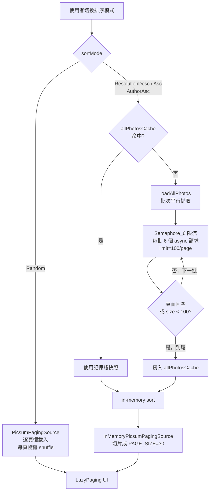

# ComposePlayground

Android Compose 練習專案，用於探索現代 Android 開發技術棧。目前整合 PokéAPI 與 Picsum Photos 兩個功能模組。

## 功能

### Pokémon 圖鑑
- **寶可夢列表**：分頁載入、Grid / List 雙視圖切換、搜尋、依屬性篩選
- **寶可夢詳情**：屬性、圖片、基本數值
- **屬性圖鑑**：以屬性分類，每種屬性呈現為一列橫向捲動列表
- **Shimmer 讀取效果**：骨架動畫作為載入佔位

### Picsum 圖庫
- **大圖網格**：兩欄等高 grid，每張以 1080×1080 px 大圖載入，示範 Coil 進場效果與磁碟快取
- **無限滾動**：Paging 3 串接，`prefetchDistance` 預取下一頁
- **全螢幕詳細頁**：顯示原始尺寸大圖、作者、原始解析度
- **Pinch-to-zoom**：雙指縮放（1×–5×）+ 平移，放回 1× 時自動回正
- **AI 圖片描述**：Gemini Nano on-device 多模態（Pixel 9 Pro+）→ ML Kit 標籤 + Gemini Nano 文字模式 → ML Kit 句子模板，三層降級策略，結果以 `LruCache` 跨頁面快取

### 全域
- **首頁菜單**：入口頁，以漸層大卡片切換各模組
- **主題切換**：Light / Dark / System，偏好設定持久化至 DataStore
- **網路監聽**：即時偵測連線狀態

## Tech Stack

| 層級 | 技術 |
|------|------|
| 語言 | Kotlin 2.3.21 |
| UI | Jetpack Compose (BOM 2026.04.01) + Material 3 |
| DI | Koin 4.2.1 |
| 網路 | Ktor Client 3.4.3 + OkHttp Engine |
| 序列化 | Kotlinx Serialization 1.11.0 |
| 導航 | Navigation3 1.1.1 |
| 圖片 | Coil 3.4.0 |
| 分頁 | Paging 3 |
| On-device AI | ML Kit Image Labeling 17.0.9 + ML Kit GenAI Prompt 1.0.0-beta2 |
| Build | AGP 9.2.0，Gradle 9.4.1，Version Catalog |
| Target | compileSdk 36，minSdk 29 |

## 架構

多模組架構：`:app` + `:core:network` + `:core:designsystem` + `:core:navigation`。Feature 程式碼（Pokémon、Picsum）暫時保留在 `:app`，未來會逐步抽成 `:feature:pokemon` / `:feature:picsum`。

依賴方向：`:app → :core:network`、`:app → :core:designsystem`、`:app → :core:navigation`，`:core` 模組之間互不依賴。

```
UI Layer        → Screen + ViewModel（MVVM）
Domain Layer    → @Immutable Domain Models、Repository 介面
Data Layer      → RepositoryImpl、PagingSource、API DTOs
Network Layer   → Ktor HttpClient、ApiService、Token/Cache（:core:network）
```

每個功能模組（Pokémon、Picsum）各自擁有：
- `di/XxxModule.kt`：Repository + ViewModel 的 Koin 註冊
- `data/model/`、`data/paging/`、`data/repository/`：資料層
- `ui/screen/xxx/`：Screen、ViewModel、components

網路層多 base URL 策略：各模組以 `named("xxxApi")` 的獨立 `ApiService` 注入，底層共用 `HttpClientFactory` 與 `CacheConfig`。

### 導航頁面

| Key | 說明 |
|-----|------|
| `Home` | 首頁菜單（模組入口） |
| `PokemonHome` | 寶可夢列表 |
| `PokemonDetail(pokemonId)` | 寶可夢詳細資訊 |
| `PokemonTypeGallery` | 依屬性分類圖鑑 |
| `PicsumGallery` | Picsum 圖庫（兩欄 grid） |
| `PicsumDetail(photoId, author, w, h)` | 全螢幕大圖 + 縮放 |
| `Settings` | 主題偏好設定 |

## Picsum 排序策略

Picsum `/v2/list` API 不支援排序參數，排序必須在 client 端執行。為了避免「點下排序後等很久」，採取 **批次平行抓取 + in-memory cache** 的策略。

### 兩條資料流



### 抓取時序

Picsum 全集約 1084 張 ≈ 11 頁（`limit=100`），並發 6：

```
Batch 1  ┌── page 1  (limit=100) ──┐
         ├── page 2                 ┤
         ├── page 3                 ├── awaitAll  ~300ms
         ├── page 4                 ┤
         ├── page 5                 ┤
         └── page 6                 ┘
                        ↓
Batch 2  ┌── page 7                 ┐
         ├── page 8                 ┤
         ├── page 9                 ├── awaitAll  ~300ms
         ├── page 10                ┤
         ├── page 11 (短頁 <100)    ┤── reachedEnd
         └── page 12 (略過)         ┘
                        ↓
                  total ≈ 600ms
```

對比序列抓取（每頁 limit=30、共 36 頁）：36 × 300ms ≈ **12s** → 改寫後 **~600ms**。

### 關鍵參數

定義於 `PicsumGalleryViewModel.kt` 的 `companion object`：

| 常數 | 值 | 用途 |
|------|----|------|
| `BULK_PAGE_LIMIT` | 100 | `/v2/list` 單頁最大張數（API 文件上限） |
| `BULK_CONCURRENCY` | 6 | 同時送出的 page 請求數，避免被 Picsum throttle |
| `MAX_BULK_PAGES` | 30 | 批次抓取頁數上限保險絲，避免 API 行為改變時無限迴圈 |

### 設計重點

- **進度回饋**：每批完成後 `setLoadProgress(loadedPages, totalPagesEstimate)`，UI 卡片顯示百分比 + 「已載入 X / Y 頁」，並以 `animateFloatAsState` 平滑過渡。
- **快取重用**：`allPhotosCache` + `Mutex` 確保第一次抓完之後，切換不同排序模式（高解↔低解↔作者）皆 in-memory 即時，不再打 API。
- **視覺一致**：排序模式仍走 `LazyPagingItems` API、以 `PAGE_SIZE=30` 切片，與 Random 模式共用同一套 grid/list/staggered 呈現邏輯。
- **遮罩生命週期**：資料就緒後**先**關掉 loading overlay，**再** `emitAll(Pager.flow)`。`Pager.flow` 是 hot flow 永不完成，若把 `setLoadingAll(false)` 只放在 `finally`，遮罩會一直卡在畫面上，直到使用者切換排序才被取消觸發。

### 為什麼不選其他策略

| 替代策略 | 不採用原因 |
|----------|------------|
| 進入 Gallery 即背景預抓 | 使用者可能根本不切排序，浪費流量 |
| 漸進式排序（部分先顯示） | 項目位置會在抓取過程中跳動，UX 差 |
| 序列抓取 + `limit=30` | 36 頁 × ~300ms ≈ 12s，正是原本的瓶頸 |
| 全火力並發（無 Semaphore） | 容易被 Picsum throttle 或誤判攻擊 |
| 寫入磁碟（DataStore / Room） | 為節省冷啟動 1–2s 而引入儲存層，CP 值低 |

## Picsum AI 圖片描述

詳細頁（`PicsumDetailScreen`）進入時，`PicsumDetailViewModel` 以縮圖 URL 呼叫 `PicsumImageAnalyzer.summarize()`，結果以 `ImageSummaryState`（`Idle | Loading | Success | Error`）暴露給 UI，顯示於底部資訊列。

### 三層策略（全程 on-device）

| Tier | 裝置條件 | 方式 |
|------|----------|------|
| 1 | Pixel 9 Pro+（Gemini Nano 多模態） | 圖片直接輸入 LLM，語意理解最準確 |
| 2 | Pixel 8 / 9a+（有 Gemini Nano，不支援多模態） | ML Kit 視覺標籤 → Gemini Nano 文字模式組句 |
| 3 | 所有其他裝置 | ML Kit 標籤 + 中文句子模板，即時可用 |

結果以 `LruCache(128)` 以 photoId 為 key 快取，重複進同一張詳細頁可秒出描述。

## Build

```bash
# 編譯檢查
./gradlew :app:compileDebugKotlin

# 建置 debug APK
./gradlew :app:assembleDebug

# 執行 unit tests
./gradlew test

# 執行 instrumented tests
./gradlew connectedAndroidTest
```

## API

| 模組 | API | Base URL |
|------|-----|----------|
| Pokémon 圖鑑 | [PokéAPI](https://pokeapi.co/)（公開，無需金鑰） | `https://pokeapi.co/api/v2/` |
| Picsum 圖庫 | [Picsum Photos](https://picsum.photos/)（公開，無需金鑰） | `https://picsum.photos/` |
